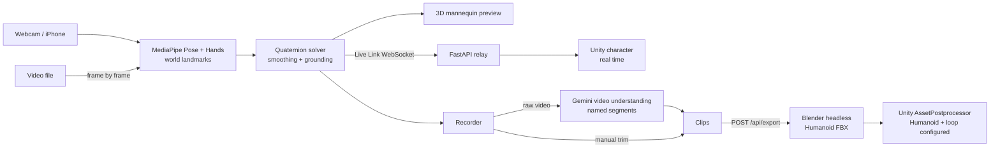

<div align="center">

# EmoteCap

### Act once. Animate anything.

Turn a webcam, an iPhone, or any video into **Humanoid animation clips for Unity**.<br>
Stream your pose live, act a whole take in one go, and let **Gemini** cut it into named, loopable moves.

[](#how-gemini-is-used)
[](#how-it-works)
[](unity/com.emotecap.mocap/README.md)
[](#how-it-works)
[](web/)
[](server/)


<sub>Live Link: the webcam actor (left) drives a physics-enabled Unity character (right) in real time.</sub>

</div>

## Why

Indie and student game developers animate their characters with whatever premade clips they can find. The move you actually need (*your* sword slash, *your* victory dance) is never in the library, and optical mocap costs thousands. EmoteCap turns the camera you already have into a mocap studio that speaks Unity.

## What you can do

| | |
|:--|:--|
| 🎥 **Live Link to Unity**<br>Your body and all ten fingers drive a Unity character over WebSocket while you act. Body colliders let it push props around a physics playground. | ✂️ **One take, many clips**<br>Act several moves in one continuous take. Gemini watches the video and returns named, loop-tagged clips with descriptions; cut points snap to your pauses. |
| 📼 **Import any video**<br>Drop in an mp4, mov or webm (up to 3 min). Every frame is analysed, the take auto-calibrates from its first T-pose, then it flows through the same pipeline. | 📦 **One click to Humanoid FBX**<br>Headless Blender writes Mixamo-named, T-pose-rest FBX files; the Unity package imports them as in-place Humanoid clips that retarget to any humanoid. |
| ✋ **Finger-level mocap**<br>48 driven bones: full body plus 30 finger joints, so fists, pointing and peace signs survive into Unity. Lost hands relax naturally instead of freezing. | 🧍 **Steady and grounded**<br>An on-screen T-pose outline for calibration, per-bone smoothing (Low / Medium / High), feet planted flat, jumps detected, and Unity easing between frames. |

<table>
  <tr>
    <td width="50%"><br><sub>Gemini sliced one take into six named clips (left); Unity plays them back (right).</sub></td>
    <td width="50%"><br><sub>Importing a phone video: every frame is analysed while the 3D preview follows.</sub></td>
  </tr>
</table>

## How Gemini is used

- **Video understanding with structured output.** The raw take (or the imported file) goes to Gemini with a JSON schema: `name`, `start`, `end`, `loop`, `description` for every move. The prompt asks for one segment per distinct action and game-style names such as `Wave_Right` or `Punching_Combo`.
- **Grounded in the motion.** Gemini's cut points are snapped to the nearest pause in the solved motion (angular speed summed over all bones), so every clip starts and ends cleanly.
- **Resilient.** If the configured model is overloaded, the server falls back through other Gemini Flash models within the same time budget; if Gemini is unreachable, the take is split at pauses locally and you still get clips.
- **Even the demo narration** was generated with Gemini text-to-speech.

## How it works



**One motion format everywhere.** Every frame is 48 quaternions (each bone's *world rotation relative to T-pose*) plus hips height ([`contracts/motion-v1.md`](contracts/motion-v1.md)). Any rig applies it as `boneWorld = delta × restWorld`, so the browser preview, the exported FBX and the Unity Live Link show exactly the same pose.

**The solver** builds an orthonormal frame per bone from a primary axis (e.g. shoulder → elbow) and a secondary axis (the elbow's bend-plane normal), and divides it by the same frame computed from a T-pose. Straight limbs reuse the previous bend normal so twists never flip; elbows and knees are clamped to 150°; One Euro filters on the landmarks and on each bone's rotation remove jitter without adding lag. Hands use the palm frame (wrist → knuckles, pinky → index) from Hand Landmarker, and each finger segment curls about the palm's lateral axis. Forward kinematics keeps the lowest sole exactly on the floor and plants standing feet flat.

**Calibration.** MediaPipe's 3D estimates of the face and of the body's lean are biased by the camera angle (we measured a 30° head tilt on a level head). A T-pose captured with the on-screen outline, or found automatically in an imported video, becomes the rest pose and cancels that bias.

## Quick start

Requirements: Node 20+, [uv](https://docs.astral.sh/uv/), Blender 4.4+ (tested on 5.1), Unity 2021.3+ (tested on 6000.5).

```bash
cp .env.example .env          # set UNITY_EXPORT_DIR to <UnityProject>/Assets/EmoteCap; GEMINI_API_KEY is optional
(cd server && uv sync && uv run uvicorn emotecap_server.main:app --port 8787)
(cd web && npm install && npm run dev)   # open http://localhost:5173 (Safari also lists an iPhone via Continuity Camera)
```

In Unity: Package Manager → **+** → **Add package from git URL…** → `https://github.com/eric20041027/EmoteCap.git?path=/unity/com.emotecap.mocap`

1. Press the orange **Calibrate T-pose** button on the camera view and stand inside the outline.
2. Exported clips land in `Assets/EmoteCap/` and import as Humanoid automatically. Drag one onto any humanoid's Animator and tick **Foot IK**.
3. For Live Link, add the **EmoteCap Live Link** component to a T-pose humanoid with no Animator Controller, press Play, and switch on **Live Link** in the web app.
4. **Fast** mode (Pose Full, hands every other frame) keeps Live Link smooth; switch to **Accurate** (Pose Heavy, hands every frame) for important takes.
5. **Import video** turns an existing clip into a take; start the video with a one-second T-pose so it calibrates itself.
6. Clip menu, physics colliders, prop reset and Live Link settings: see the [Unity package README](unity/com.emotecap.mocap/README.md).

## Tech stack

Gemini API (`google-genai`: structured video understanding, text-to-speech) · MediaPipe Pose + Hand Landmarker · three.js · React · Vite · TypeScript · FastAPI · Python · Blender (bpy) · Unity (C#)

## Tests

`cd web && npm test` (220+ tests: motion solver, filters, calibration, video import, hand tracking, UI logic) · `cd server && uv run pytest` (350+ tests: export, relay, Gemini slicing and model fallback with a mocked API, a real Blender smoke test).

---

<div align="center">
  <br>
  <sub>Built overnight at <b>HackNite 2026</b>. Our Live Link actor didn't quite make it to morning.</sub>
</div>
