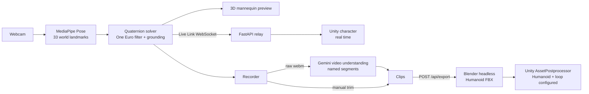

# EmoteCap

> **Act once. Animate anything.**

**Webcam motion capture for Unity.** Act out a move in front of your laptop camera and get a Humanoid FBX animation clip you can drop onto any humanoid character — no mocap suit, no studio, and no more settling for whatever Mixamo happens to have. Live Link mirrors your pose onto a Unity character in real time.

Built in 12 hours at HackNite 2026.

## Why

Indie and student game devs animate characters with whatever premade clips they can find. The move you actually need — *your* sword slash, *your* victory dance — is never in the library, and optical mocap costs thousands. EmoteCap turns the webcam you already have into a mocap studio that speaks Unity.

## What it does

- **Real-time capture in the browser** — MediaPipe Pose (33 landmarks) plus Hand Landmarker (21 per hand) feed a custom quaternion solver; a 3D mannequin mirrors you at camera frame rate. Nothing is uploaded to capture.
- **Finger-level mocap** — 48 driven bones: full body plus all 30 finger joints, so fists, pointing, and peace signs survive all the way into Unity.
- **Record → trim → FBX** — a one-click export runs Blender headless and writes a Humanoid-ready FBX (Mixamo bone names, T-pose rest) plus a sidecar with the clip name and loop flag.
- **Zero-setup Unity import** — the EmoteCap Unity package's `AssetPostprocessor` imports every clip as an in-place Humanoid animation, so it retargets to any humanoid (verified on Mixamo's Y Bot).
- **Live Link** — stream your pose over WebSocket to a Unity character while you act.
- **Gemini one-take slicing** — record several moves in one continuous take; Gemini watches the video and splits it into named, loop-tagged clips (`Wave_Right`, `Sword_Slash`, …), with cut points snapped to your pauses. Rename, retime, and export them all in one click. Without a key, the take is split at pauses locally.

## How it works



**One motion format everywhere.** Every frame is 48 quaternions — each bone's *world rotation relative to T-pose* — plus hips height ([`contracts/motion-v1.md`](contracts/motion-v1.md)). Any rig applies it as `boneWorld = delta × restWorld`, so the browser preview, the exported FBX, and the Unity Live Link all show exactly the same pose.

**The solver** builds an orthonormal frame per bone from a primary axis (e.g. shoulder → elbow) and a secondary axis (the elbow's bend-plane normal), and divides it by the same frame computed from a T-pose. Straight limbs reuse the previous bend normal so twists never flip; elbows and knees are clamped to 150°; a One Euro filter removes jitter without lag. Hands use the palm frame (wrist → knuckles, pinky → index) from Hand Landmarker, and each finger segment curls about the palm's lateral axis. Forward kinematics on the canonical skeleton keeps the lowest sole exactly on the floor, and Unity's Live Link re-grounds each rig by its own sole height, so feet neither sink nor float.

**Gemini** receives the raw take with structured-output JSON (name, start, end, loop, description). Its cut points are then snapped to the nearest pause using motion energy (angular speed summed over all bones). If Gemini is unavailable, the take is split at pauses locally.

## Quick start

Requirements: Node 20+, [uv](https://docs.astral.sh/uv/), Blender 4.4+ (tested on 5.1), Unity 2021.3+ (tested on 6000.5).

```bash
cp .env.example .env          # set UNITY_EXPORT_DIR to <UnityProject>/Assets/EmoteCap; GEMINI_API_KEY is optional
(cd server && uv sync && uv run uvicorn emotecap_server.main:app --port 8787)
(cd web && npm install && npm run dev)   # open http://localhost:5173 in Chrome
```

In Unity: Package Manager → **+** → **Add package from git URL…** → `https://github.com/eric20041027/EmoteCap.git?path=/unity/com.emotecap.mocap`

1. Exported clips land in `Assets/EmoteCap/` and import as Humanoid automatically. Drag one onto any humanoid's Animator and tick **Foot IK**.
2. For Live Link, add the **EmoteCap Live Link** component to a T-pose humanoid with no Animator Controller, press Play, and switch on **Live Link** in the web app.
3. **Fast** mode (Pose Full, hands every other frame) keeps Live Link smooth; switch to **Accurate** (Pose Heavy, hands every frame) for important takes.

## Tech stack

Gemini API (`google-genai`, structured video understanding) · MediaPipe Pose + Hand Landmarker · three.js · React · Vite · TypeScript · FastAPI · Python · Blender (bpy) · Unity (C#)

## Tests

`cd web && npm test` (motion solver, filters, clip resampling, segmentation, UI logic) · `cd server && uv run pytest` (export, relay, Gemini slicing with a mocked API, a real Blender smoke test).
