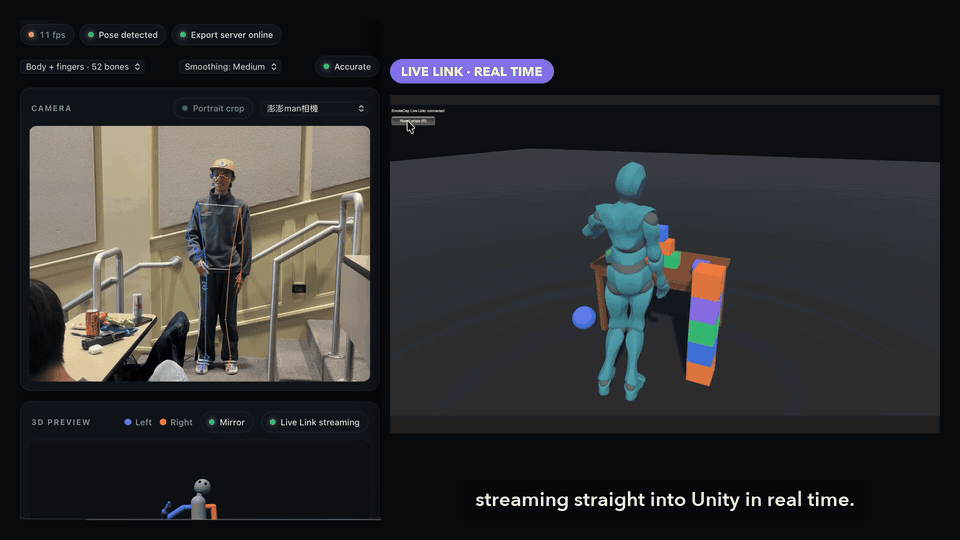
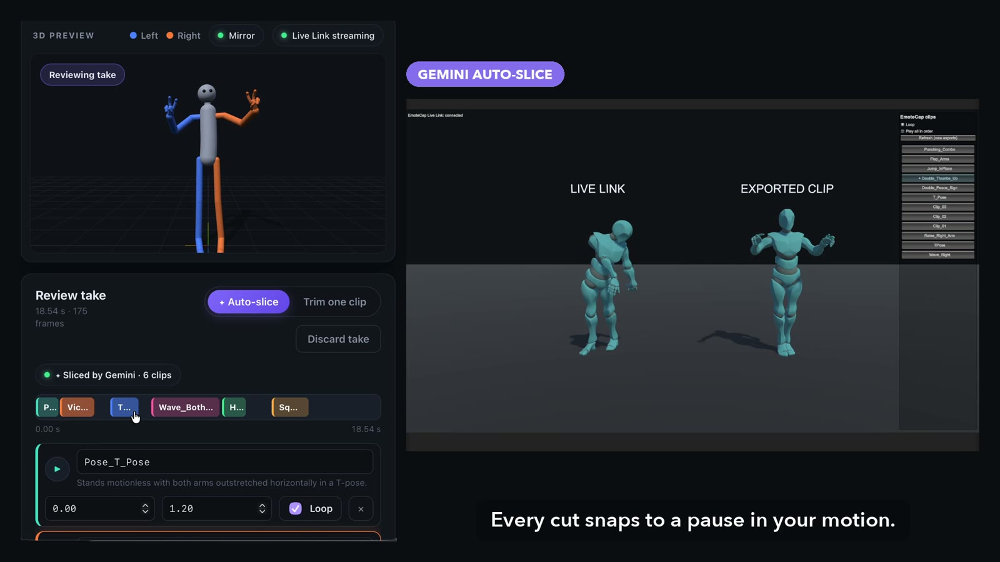
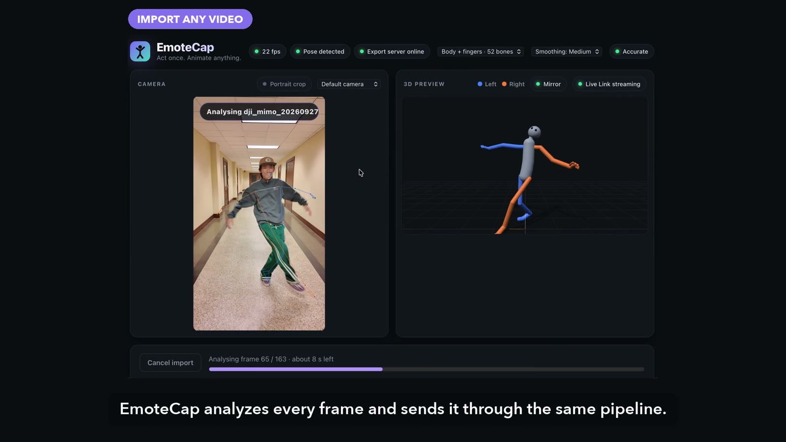
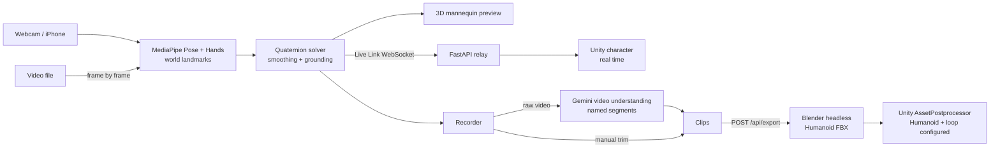
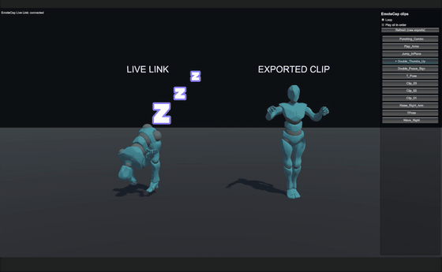

<div align="center">

# EmoteCap

### Act once. Animate anything.

Turn a webcam, an iPhone, or any video into **Humanoid animation clips for Unity**.<br>
Stream your pose live, act a whole take in one go, and let **Gemini** cut it into named, loopable moves.

[](#how-gemini-is-used)
[](#how-it-works)
[](unity/com.emotecap.mocap/README.md)
[](#how-it-works)
[](web/)
[](server/)

<a href="https://youtu.be/ETPATTBDosc"></a>

<a href="https://youtu.be/ETPATTBDosc"></a>

<sub>Live Link: the webcam actor (left) drives a physics-enabled Unity character (right) in real time. Click for the full demo.</sub>

</div>

## Why

Indie and student game developers animate their characters with whatever premade clips they can find. The move you actually need (*your* sword slash, *your* victory dance) is never in the library, and optical mocap costs thousands. EmoteCap turns the camera you already have into a mocap studio that speaks Unity.

## What you can do

| | |
|:--|:--|
| 🎥 **Live Link to Unity**<br>Your body and all ten fingers drive a Unity character over WebSocket while you act. Body colliders let it push props around a physics playground. | ✂️ **One take, many clips**<br>Act several moves in one continuous take. Gemini watches the video and returns named, loop-tagged clips with descriptions; cut points snap to your pauses. |
| 📼 **Import any video**<br>Drop in an mp4, mov or webm (up to 3 min). Every frame is analysed, the take auto-calibrates from its first T-pose, then it flows through the same pipeline. | 📦 **One click to Humanoid FBX**<br>Headless Blender writes Mixamo-named, T-pose-rest FBX files; the Unity package imports them as in-place Humanoid clips that retarget to any humanoid. |
| ✋ **Finger-level mocap**<br>48 driven bones: full body plus 30 finger joints, so fists, pointing and peace signs survive into Unity. Lost hands relax naturally instead of freezing. | 🧍 **Steady and grounded**<br>An on-screen T-pose outline for calibration, per-bone smoothing (Low / Medium / High), feet planted flat, jumps detected, and Unity easing between frames. |

<table>
  <tr>
    <td width="50%"><br><sub>Gemini sliced one take into six named clips (left); Unity plays them back (right).</sub></td>
    <td width="50%"><br><sub>Importing a phone video: every frame is analysed while the 3D preview follows.</sub></td>
  </tr>
</table>

## How Gemini is used

- **Video understanding with structured output.** The raw take (or the imported file) goes to Gemini with a JSON schema: `name`, `start`, `end`, `loop`, `description` for every move. The prompt asks for one segment per distinct action and game-style names such as `Wave_Right` or `Punching_Combo`.
- **Grounded in the motion.** Gemini's cut points are snapped to the nearest pause in the solved motion (angular speed summed over all bones), so every clip starts and ends cleanly.
- **Resilient.** If the configured model is overloaded, the server falls back through other Gemini Flash models within the same time budget; if Gemini is unreachable, the take is split at pauses locally and you still get clips.
- **Even the demo narration** was generated with Gemini text-to-speech.

## How it works



**One motion format everywhere.** Every frame is 48 quaternions (each bone's *world rotation relative to T-pose*) plus hips height ([`contracts/motion-v1.md`](contracts/motion-v1.md)). Any rig applies it as `boneWorld = delta × restWorld`, so the browser preview, the exported FBX and the Unity Live Link show exactly the same pose.

**The solver** builds an orthonormal frame per bone from a primary axis (e.g. shoulder → elbow) and a secondary axis (the elbow's bend-plane normal), and divides it by the same frame computed from a T-pose. Straight limbs reuse the previous bend normal so twists never flip; elbows and knees are clamped to 150°; One Euro filters on the landmarks and on each bone's rotation remove jitter without adding lag. Hands use the palm frame (wrist → knuckles, pinky → index) from Hand Landmarker, and each finger segment curls about the palm's lateral axis. Forward kinematics keeps the lowest sole exactly on the floor and plants standing feet flat.

**Calibration.** MediaPipe's 3D estimates of the face and of the body's lean are biased by the camera angle (we measured a 30° head tilt on a level head). A T-pose captured with the on-screen outline, or found automatically in an imported video, becomes the rest pose and cancels that bias.

## Quick start

The browser app and the server are all you need to capture, preview, record and slice. Blender adds FBX export, Unity adds Live Link and the clips in your game.

### 1. Install the tools

| Tool | Version | Needed for |
|---|---|---|
| [Node.js](https://nodejs.org/) | 22 or newer (tested on 26) | the web app |
| [uv](https://docs.astral.sh/uv/getting-started/installation/) | any recent (it installs Python 3.12 for you) | the server |
| [Blender](https://www.blender.org/download/) | 4.4 or newer (tested on 5.1) | FBX export (optional) |
| [Unity](https://unity.com/download) | Unity 6 recommended (tested on 6000.5; the package targets 2021.3+) | Live Link and clips in Unity (optional) |
| Chrome or Safari, and a webcam | Safari also lists an iPhone through Continuity Camera | capture |

### 2. Get the code and configure it

```bash
git clone https://github.com/eric20041027/EmoteCap.git
cd EmoteCap
cp .env.example .env
```

Open `.env` and set:

- `BLENDER_PATH`: your Blender executable (the default is the macOS path; examples for Windows and Linux are in the file).
- `GEMINI_API_KEY` (optional): a key from [Google AI Studio](https://aistudio.google.com/apikey).
- `UNITY_EXPORT_DIR` (optional): `<YourUnityProject>/Assets/EmoteCap`, so exported clips land in Unity by themselves.

> [!NOTE]
> **No Gemini API key? Everything still works.** Auto-slice still finds the moves in your take by splitting it at the pauses in your motion, but the clips are named `Clip_01`, `Clip_02`, … instead of Gemini's names and descriptions (`Wave_Right`, `Punching_Combo`, …). You can rename them before exporting.

### 3. Run it (two terminals)

```bash
# Terminal 1: the server, on http://localhost:8787
cd server
uv sync
uv run uvicorn emotecap_server.main:app --port 8787
```

```bash
# Terminal 2: the web app, on http://localhost:5173
cd web
npm install
npm run dev
```

The first `npm run dev` downloads the MediaPipe models (about 48 MB). Open **http://localhost:5173**, allow camera access, and check that the status bar says **Export server online**.

### 4. Capture your first clips (browser only)

1. Stand 2–3 m from the camera so your whole body is in frame.
2. Press the orange **⚠ Calibrate T-pose** button on the camera view and hold a T-pose inside the outline until the countdown ends.
3. Press **Record**, act a few moves with a short pause between them, then press **Stop**.
4. Press **✦ Auto-slice with Gemini**, adjust the clips if you like, then **Export all**. The FBX files are listed for download (and copied into Unity when `UNITY_EXPORT_DIR` is set).

Already have a video? **Import video** turns it into a take instead; start the video with a one-second T-pose so it calibrates itself.

### 5. Use it in Unity (optional)

1. Package Manager → **+** → **Add package from git URL…** → `https://github.com/eric20041027/EmoteCap.git?path=/unity/com.emotecap.mocap`
2. Bring in a Humanoid character, for example **Y Bot** from [Mixamo](https://www.mixamo.com/) (download as *FBX for Unity*, in T-pose), and set **Rig → Animation Type** to **Humanoid**.
3. **Clips:** exported FBX files in `Assets/EmoteCap/` import as Humanoid clips. Add **EmoteCap Clip Player** to the character to play them from an on-screen menu, or drag a clip into your own Animator Controller and tick **Foot IK**.
4. **Live Link:** add **EmoteCap Live Link** to a character with an Avatar and *no* Animator Controller, press Play, then switch on **Live Link** in the web app.
5. Physics props, prop reset and Live Link settings: see the [Unity package README](unity/com.emotecap.mocap/README.md).

### Troubleshooting

- **"Export server offline"** in the web app: the server in Terminal 1 is not running on port 8787.
- **Export fails**: `BLENDER_PATH` in `.env` does not point to a Blender executable. Restart the server after editing `.env`.
- **Head or body looks tilted**: calibrate again (after reloading the page, moving the camera or switching cameras).
- **Choppy Live Link**: keep **Fast** mode on; use **Accurate** for recordings and imported videos.
- **iPhone missing from the camera list**: use Safari, keep the iPhone locked, mounted and near the Mac.

## Tech stack

Gemini API (`google-genai`: structured video understanding, text-to-speech) · MediaPipe Pose + Hand Landmarker · three.js · React · Vite · TypeScript · FastAPI · Python · Blender (bpy) · Unity (C#)

## Tests

`cd web && npm test` (220+ tests: motion solver, filters, calibration, video import, hand tracking, UI logic) · `cd server && uv run pytest` (350+ tests: export, relay, Gemini slicing and model fallback with a mocked API, a real Blender smoke test).

---

<div align="center">
  <br>
  <sub>Built overnight at <b>HackNite 2026</b>. Our Live Link actor didn't quite make it to morning.</sub>
</div>
