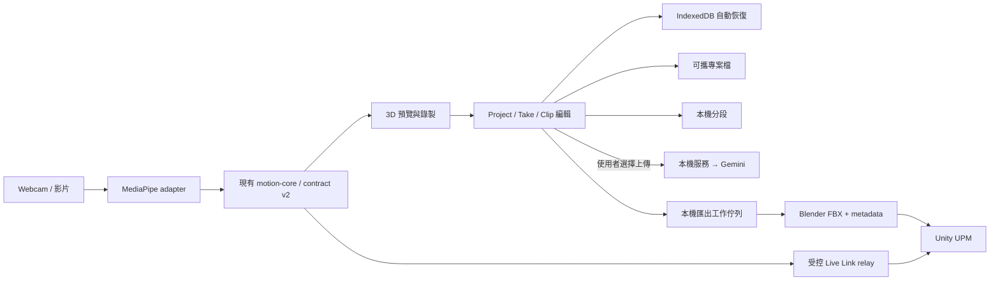

# EmoteCap：從 Hackathon MVP 到正式開源產品

日期：2026-10-06（America/New_York）  
狀態：產品方向仍為提案；M1 已採 Native 實作，結果見 [M1 交付記錄](../reports/2026-10-06-release-foundation.md)。以下盤點保留初始基準，尚未完成 M2–M5。
檢查基準：`main` / `713d349df05aa26b6b95a1b7974f7f3d8e574149`  
本機：`C:\Users\smallfire123123\Desktop\EmoteCap`

## 1. 產品決定摘要

**保留 EmoteCap 的核心：讓 Unity 開發者用一台普通攝影機或一段影片，錄一次、整理出一組自己需要的人形動畫。**

首版提案是本機運作的動畫製作工具：瀏覽器負責擷取、預覽與剪輯，本機服務負責匯出，Unity 套件負責接收。Gemini 提供可選的動作命名與分段；不用 API key 仍能完成錄製、手動／本機切片與匯出。

本提案暫採兩個假設：主要使用者是 Unity 獨立／學生遊戲開發者；優先解決從安裝到匯出的完整使用體驗。使用者尚未回覆本輪的兩個方向問題，這些不是已確認需求。

產品價值應以「使用者能把需要的動作帶進遊戲」衡量。第一版避免同時投入雲端帳號、多人協作、手機原生 App、全新追蹤模型與多引擎整合。

## 2. 實際盤點

### 已有而且值得保留的資產

| 資產 | 原始碼位置 | 處理方式 |
|---|---|---|
| 單一動作解算核心、校正、防抖、貼地、跳躍與手指 | `web/src/motion/` | 保留；先建立回歸基線，品質改善以測量決定 |
| Webcam 與影片走同一套動作表示 | `web/src/capture/`、`web/src/import/` | 保留兩種入口，改善載入、取消與錯誤恢復 |
| 3D 預覽、錄製、手動裁切、多片段編輯 | `web/src/preview/`、`web/src/record/`、`web/src/take/` | 保留既有邏輯，整合成專案工作流程 |
| Gemini 分段及本機動作能量備援 | `server/emotecap_server/gemini.py`、`web/src/take/sliceTake.ts` | 本機分段成為正式選項；Gemini 明確標示為雲端操作 |
| Blender headless FBX 匯出、Unity UPM 套件 | `server/blender/`、`unity/com.emotecap.mocap/` | 保留格式與骨骼座標語意，補相容性測試 |
| 共用骨架與測資 | `contracts/bones.json`、`contracts/fixtures/` | 作為相容性基準；目前實際版本為 v2 |

目前模組已按功能分開，沒有理由因為是 MVP 就全面換框架。第一輪保留 React、TypeScript、Three.js、MediaPipe、FastAPI、Blender、Unity 與現有資料夾；等邊界穩定且出現第二個消費者，再考慮把 motion-core 發布為獨立套件。

### 有證據的缺口

| 發現 | 證據 | 對使用者的影響 | 處理里程碑 |
|---|---|---|---|
| 錄製資料留在 React state，未見專案持久化 | `web/src/record/useRecorder.ts:49`；目前 localStorage 只保存設定／鏡頭選擇 | 重新整理／關閉頁面後不能恢復 take | M2 |
| 跨次匯出同名檔案會覆蓋 | `server/emotecap_server/exporter.py:144`、`test_export_clips_overwrites_an_existing_export` | 前一次動畫可能被無提示取代 | M3 |
| 契約文件仍寫 v1／18 根，程式是 v2／48 根 | `contracts/motion-v1.md:29`、`contracts/bones.json:2`、`Runtime/EmoteCapContract.cs` | 新貢獻者容易實作出不相容資料 | M1 |
| MotionFrame 主要驗證陣列長度，未限制非有限值、時間次序、四元數長度 | `server/emotecap_server/contract.py:16` | 壞資料可進入昂貴的匯出程序 | M1 |
| 模型使用 `latest` URL，已存在檔案不驗證內容 | `web/scripts/fetch-mediapipe.mjs:18`、`:54` | 安裝結果可能漂移，損毀快取可能被當成可用 | M1 |
| 本機下載需要 Node 的系統憑證／代理支援 | 本輪初次 fetch 失敗；加 `--use-system-ca --use-env-proxy` 後成功 | 首次啟動需要可理解的診斷與復原方法 | M1、M2 |
| Live Link relay 轉發任意來源文字，未見 hello 驗證或單一 source 控制 | `server/emotecap_server/relay.py:26`、`:59` | 不相容來源、多個來源與慢接收端缺乏明確處理 | M3 |
| 本機影片暫存未見明確清理／保存策略 | `server/emotecap_server/main.py`、`takes.py` | 使用者不知道影片留在哪裡、如何刪除 | M3 |
| 缺 LICENSE、貢獻指南、CI workflow、Unity 自動化測試 | 對目前追蹤檔案的盤點 | 對外使用權、維護與發布標準不完整 | M1、M4、M5 |

上述為本輪檔案檢查結果，不是完整資安、授權或動作品質稽核。沒有因這次規劃修改歷史、移除素材或發布授權。

### 本輪實測

環境：Windows；Node `24.19.0`；npm `11.21.0`（暫用執行器）；uv `0.12.6`；Python `3.12.14`。依 repository 既有 lockfiles 安裝，未更新依賴版本。

| 檢查 | 結果 | 意義與限制 |
|---|---|---|
| Git clone、remote、工作版本 | 成功；上述 commit | 完整 clone 到獨立新目錄 |
| 前端 Vitest | **225 passed / 30 files** | 邏輯測試通過，未測真實攝影機 |
| TypeScript `--noEmit` | 通過 | 型別檢查通過 |
| 後端 `uv run --frozen --python 3.12 pytest -q -m 'not slow'` | **352 passed、2 failed、2 deselected** | 兩個 failure 都是 `/bin/sh` 測試替身不能在 Windows 直接執行；不等於 Blender 本體失敗 |
| 模型下載 | 初次失敗；啟用系統 CA 與環境代理後成功 | 未關閉 TLS 驗證；究竟是哪項環境差異造成初次失敗尚未分開定位 |
| `npm run build`（含 prebuild，模型已快取） | 通過；有 bundle 大於 500 kB 的警告 | 不代表 fresh install 在所有網路都能成功 |
| 真實攝影機、Blender smoke、Unity 播放、Gemini 真實呼叫 | **未執行** | 不可把上述 unit/build 結果稱為端到端通過 |

本次只新增規劃文件；`node_modules/`、`.venv/`、模型、`dist/` 是被忽略的本機驗證產物。沒有啟動持續服務、呼叫付費 Gemini、建立 release 或 push。

## 3. 第一版的使用流程

1. **開始使用**：開啟本機 EmoteCap，看到鏡頭、模型與匯出能力是否就緒。沒有 Blender 仍可錄製與保存，介面說明如何啟用 FBX。
2. **建立專案**：使用 Webcam 或匯入影片；能查看示範專案，不必先開鏡頭。校正、全身入鏡與低可信度提示直接出現在預覽。
3. **錄製／匯入**：有進度、取消與自動恢復；完成的 take 可重新開啟。既有三分鐘上限先保留。
4. **整理動作**：在同一個 Review 畫面預覽、修剪、命名、分段、標記循環；原始 take 保持不變，修改可撤銷。
5. **帶進 Unity**：選擇片段匯出；看到等待、處理、完成、失敗狀態。失敗可重試，不必重錄；相同名稱不會悄悄取代舊輸出。

Live Link 保留為擷取畫面的獨立開關。啟用 Gemini 前顯示將送出的影片與目的；使用者不開啟它，影片就不因分段而離開本機。

## 4. 架構提案

### 邊界與資料

- **motion-core**：保留純數學與 canonical world-delta quaternion 語意。無 React、網路、雲端或檔案系統依賴。影像偵測與動作解算分開，能以測資比較不同 adapter。
- **Web Studio**：現有 UI 漸進整合。新增 `web/src/project/` 管理 Project、Take、Clip 的識別與保存；新增 `web/src/jobs/` 管理匯出狀態。先不全面搬成 monorepo packages。
- **保存**：IndexedDB 是自動恢復快取；可攜 `.emotecap` 專案檔是使用者可備份的資料。兩者分開標示。專案檔包含 manifest、schema version、motion、片段編輯與可選原始影片；不保存 API key。匯入檢查格式版本、大小與解壓後上限。
- **原始與衍生資料**：Take 保存原始動作與校正／模型版本資訊；Clip 是對 Take 的時間範圍及編輯設定；ExportJob 固定一份 clip revision。改名或重試不改寫原始 take。
- **本機服務**：保留 FastAPI 與 Blender subprocess。增加 `server/emotecap_server/jobs/` 管理有限佇列與 job 目錄。首版每次只執行一個 Blender 工作，其餘排隊；取消只終止該工作啟動的程序。
- **外部 AI**：先只有 Gemini 一個雲端選項，不先建立多供應商平台。API key 只留在後端；本機分段正常可用，雲端失敗原因可見且不破壞 take。
- **Unity**：保留 UPM 路徑，補 `Tests/`、`Samples~/`、`Documentation~/` 與版本化協定檢查。提供可合法散布的自製示範骨架。

### 必須守住的相容性

目前 canonical 資料是 **v2、48 driven bones、192 rotation values、52 exported bones**；body export 是 22 根輸出骨骼，但現行輸入 frame 仍含 192 個 rotation values。`h.x`、`h.z` 為 0；root motion 仍以原地動畫為主。

資料夾中 `motion-v1.md` 的名稱是歷史遺留；第一階段修正文義並保留路徑。任何將來的 frame 變更，都必須同步 Web、server、FBX、Unity 與 fixture，另寫升級／拒絕規則，不能只改一端。

## 5. 範圍與發布里程碑

每個里程碑產出能獨立驗收的增量。跨 subsystem 的詳細實作分成不同計畫，避免一次要求執行者讀完整個 v1。

| 里程碑 | 可交付結果 | 出口條件 |
|---|---|---|
| **M1：可信任的開發基線** | 修正 Windows 測試、協定說明／一致性、輸入驗證、模型驗證與 CI | Windows/macOS/Linux unit 與 Web build 通過；測試明確區分 Blender／Unity／鏡頭；詳見本輪 foundation plan |
| **M2：能保存工作的 Studio alpha** | 安裝診斷、示範專案、Project/Take/Clip、IndexedDB 恢復、專案檔匯入匯出、基本鍵盤操作 | 錄製／匯入→保存→重新整理→恢復→剪輯；磁碟／配額錯誤能告知並保留可下載資料 |
| **M3：可靠輸出與資料控制 beta** | job 排程／進度／取消／重試、依 job 隔離輸出、影片清理、Gemini opt-in、relay 檢查與配對 | 同名輸出不互相覆蓋；逾時／重啟可恢復；未 opt-in 無雲端影片流量；第二個 source 不混流 |
| **M4：動畫與 Unity 品質候選版** | 真實動作測試集、匯出／預覽／Unity 一致性、UPM Tests 與 Samples、效能量測 | 舉右手方向一致、比例正確、時間誤差至多一輸出幀；在至少兩個可散布人形 rig 播放；實測報告含失敗案例 |
| **M5：可公開發布的 v1.0** | Windows 使用者發行包、固定版本 UPM、開源授權／第三方清冊、貢獻／安全／支援文件與 release 流程 | 從乾淨機器完成新手驗收、發行物 SHA256 與來源 commit 可追溯、發布檢查全通過 |

M1 已有可執行細節：[Foundation 規格](2026-10-06-release-foundation-design.md)、[Foundation 實作計畫](../plans/2026-10-06-release-foundation.md)。M2–M5 在本文件定義產品邊界與驗收目標；各階段開始前依已接受的產品方向另寫對應實作計畫。

### 第一版包含

單人全身＋手指；Webcam／影片；校正與預覽；錄製／恢復／可攜專案；非破壞式裁切與命名；本機與可選 Gemini 分段；原地 Humanoid FBX；本機 Unity Live Link；失敗恢復與清楚文件。

### 後續版本再評估

多人、多鏡頭、臉部／表情捕捉、水平 root motion、Blender／Unreal／Godot 專用整合、BVH／glTF 匯出、雲端工作區、動作市集、自訓大型模型。Demo 的物理道具與碰撞保留為範例，不成為主要產品導航。

## 6. 支援、品質與可用性

**首個正式支援目標提案：Windows 11 + 桌面 Chrome/Edge + Unity 6。** macOS/Linux 先跑程式測試並接受社群驗證；只有完成同一份實機流程，才列為正式產品支援。現有 `unity: 2021.3` 宣告不是本輪驗證結果，需在 M4 用實際測試決定保留或提高。iPhone Continuity Camera 保留既有能力，先列為 macOS 實驗性流程。

先交付能從 source 一個入口啟動的版本，再提供內含 Web build 與本機 server runtime 的 Windows 發行包。封裝前先驗證 MediaPipe 在內嵌瀏覽器的支援；目前優先用系統瀏覽器，不立即選 Electron/Tauri。Blender 先由使用者安裝並選擇路徑，發行包不預設攜帶 Blender／第三方角色。

建議的 v1 驗收指標（是目標，不是已達成的測量）：

- 5 位未參與開發的 Unity 使用者中至少 4 位，在必要工具／模型下載完成後，能依文件於 10 分鐘內把示範動作帶進 Unity，不需維護者代操作。
- 已完成且顯示「已保存」的 take，重新整理後能恢復；錄製中每 5 秒 checkpoint，強制關閉測試最多損失最後一個尚未確認完成的 checkpoint 區段。
- 以固定、取得授權的影片比較改版前後：記錄追蹤失敗率、靜止抖動、滑步、延遲與匯出耗時；沒有數據就不宣稱品質改善。遮擋／轉身／離鏡等限制寫入產品說明。
- 以指定的測試筆電記錄 Fast 模式 720p 的有效 FPS、p95 延遲與操作反應；正式門檻在 M4 基線量測後寫入 release matrix。不可把 GPU 桌機結果代表一般筆電。
- 不依賴拖曳或顏色才能完成主要流程：時間可用鍵盤輸入、狀態有文字、焦點可見、進度可供輔助工具辨識。

MediaPipe 官方說明 `detectForVideo()` 是同步執行且會阻塞 UI 執行緒；因此 worker 搬移應由量測驅動，並驗證 GPU／OffscreenCanvas 相容性後導入。[官方 Web 指南](https://developers.google.com/edge/mediapipe/solutions/vision/pose_landmarker/web_js)

## 7. 開源與發布條件

**程式授權提案為 MIT，但現在不加 LICENSE。** 先確認原 hackathon 貢獻者的權利與一致選擇，再落實授權、copyright 與 UPM／發行包中的 notice。公開 repository 的可讀取狀態不能代替明確授權。[GitHub 官方說明](https://docs.github.com/en/repositories/managing-your-repositorys-settings-and-features/customizing-your-repository/licensing-a-repository)

正式 release 前應完成：

- 檢查現況及 Git 歷史中的敏感資訊；若找到實際憑證，先撤銷／輪替，再單獨評估歷史處置。保留 hackathon 來源與貢獻記錄。
- 建立第三方清冊：npm/Python 套件、MediaPipe 模型及 WASM、Blender、字型／圖片／範例影片／角色；逐項記錄來源、版本、雜湊、授權與發行包是否包含。模型不能只套用 SDK 的授權結論。
- 根目錄補 `LICENSE`、`CONTRIBUTING.md`、`SECURITY.md`、`CHANGELOG.md`、Issue/PR template 與支援政策；README 主流程用英文，保留繁中入門文件。
- UPM 套件補測試、Samples、Documentation、Changelog 與 third-party notices，依官方套件結構整理。[Unity 官方結構](https://docs.unity3d.com/Manual/cus-layout.html)
- 首次公開發行由 release checklist 驗證 artifacts、校驗碼、clean-machine 安裝及版本相容表；通過才建立版本 tag／GitHub Release。

本機 raw video 預設不長期留存；保存原片、傳給 Gemini、刪除資料是三個不同的使用者操作。Gemini SDK 現在已嘗試刪除 Files API 上傳檔；正式版還要把刪除失敗與本機暫存清理納入測試。Google 文件的「Files API 自動於 48 小時刪除」只描述該 API 的檔案，不等於對全部雲端處理資料的承諾。[Files API](https://ai.google.dev/gemini-api/docs/files)

## 8. 目前需要討論的決定

| 決定 | 本提案預設 | 改變時的影響 |
|---|---|---|
| 第一群使用者 | Unity 獨立／學生開發者 | 換成一般 3D 創作者，需提前安排通用格式與 Blender 工作流程 |
| 首輪優先價值 | 完整使用流程與可靠性 | 若優先動作品質，M4 的 benchmark 先移到 M2 前；保存與匯出防覆蓋仍保留 |
| 第一個正式平台 | Windows + 系統瀏覽器 | 跨平台同時正式支援會增加每次發布的實機驗證成本 |
| 開源授權 | MIT 提案，貢獻者確認後採用 | 影響再利用條件與發布包文件，不能由缺少 LICENSE 推定既有權利 |
| 開發執行方式 | Native 逐項實作；最後獨立審查 | 也可採分工代理逐項實作與審查；本輪只有規劃，尚未啟動 |

現有 `CLAUDE.md` 中的 12 小時賽程、lead Mac 限制與當時分工屬歷史開發背景。本輪依使用者明確提出的重新規劃工作新增文件，保留舊規格與計畫作為歷史；開始 M1 時再更新持續有效的協作規則。
